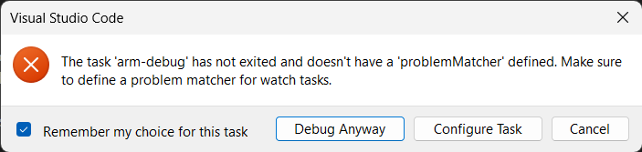

# Développement ASM ARM sur x86 v2


Ce projet a été fait avec amour pour les élèves de l'université de Sherbooke qui ne veulent pas faire leurs devoirs d'IFT209 sur les ordinateurs de l'école ou d'installer l'ÉNORME image de machine virtuelle de 15gb qui est littéralement impossible à télécharger (j'ai essayé 2 fois et j'ai abandonné).

Je vous prend donc par la main pour vous aider à configurer un environnement de développement assembly beaucoup plus légé et moderne que la solution proposée en cours.

## Pré-requis

Le DevContainer de ce projet est configuré spécifiquement pour permettre le développement assembleur aarch64 sur les ordinateurs x86.

### Visual Studio Code

1. Installez Visual Studio Code à partir du [site officiel](https://code.visualstudio.com/download).
1. Installez l'extension suivante dans *Visual Studio Code*:
    - [Remote Containers](https://marketplace.visualstudio.com/items?itemName=ms-vscode-remote.remote-containers)

### Docker

1. Suivez les instructions d'installation à partir du [site officiel](https://docs.docker.com/engine/install/). Pour un installation clé en main, installez [Docker Desktop](https://www.docker.com/products/docker-desktop/).

> **Utilisateurs Windows:** Pour un installation plus légère, installez manuellement WSL et Docker avec les instructions dans [ce document](/wsl-configuration.md).

## Utiliser le Dev Container
1. Téléchargez la dernière version du DevContainer [ici](https://github.com/DehCrep/IFT209-DevContainer/releases/latest).
1. Dézippez la dans le même dossier que votre projet. *Les dossiers [`.devcontainer`](.devcontainer) [`.vscode`](.vscode) devraient se trouver à sa racine.*

2. Ouvrez votre dossier de travail avec *Visual Studio Code*. Celui-ci devrait vous proposer de rouvrir le dossier dans le DevContainer. Faites-le!  
Si vous ne voyez pas le prompt, assurez vous que le dossier [`.devcontainer`](.devcontainer) se situe bien à la racine de votre dossier de travail.  
*Vous pouvez forcer Visual Studio Code à lancer le Dev Container en appuyant sur `f1` et en sélectionnant `Dev Containers: Reopen in Container`.*

> **Remarque:** Au premier lancement, Docker téléchargera les fichiers nécéssaires pour l'exécution de l'environnement de développement. Ça prendra quelques minutes. Vous verrez apparaître vos fichiers dans l'explorateur à gauche lorsque le processus sera fini. Le libellé du ruban bleu en bas à gauche devrait aussi indiquer `armdevenv`.

La page va se recharger et vous verrez plusieurs lignes défiler sur un terminal au bas de l'écran.

## Compiler un programme

Le container vient préinstallée avec `make` ainsi que les outils de cross-compilation pour ARM (`gcc`, `as`, `ld`).

Ils peuvent être appelés avec leur nom originaux ainsi que leur alias:
```bash
#aarch64-linux-gnu-as --gstabs ./prog.as -o ./prog.o
# même chose que:
as --gstabs ./prog.as -o ./prog.o

#aarch64-linux-gnu-ld -e Main ./prog.o  -o ./prog -lc
# même chose que:
ld -e Main ./prog.o  -o ./prog -lc

#aarch64-linux-gnu-gcc ...
# même chose que:
gcc ...
```

Vous pouvez compiler les projets qui ont un makefile sans soucis, puisque make prend aussi en compte les alias.
```bash
# En ayant cd où il y a un Makefile.
make
```

## Exécution

Vous ne pouvez pas directement lancer un programme de la même façon que la machine virtuelle de l'école.

Utilisez plutôt la fonction `arm-run [file]` ou son alias `ar [file]`:
```bash
#arm-run ./prog
# Même chose que:
ar ./prog
```

## Débogage

QEMU ne supporte pas le débogage avec gdb nativement, mais il permet l'utilisation de la fonctionnalité de serveur de débogage:


1. Dans un premier terminal, lancez d'abord votre programme avec la fonction `arm-debug [file]` ou son alias `adb [file]`.
    ```bash
    #arm-debug ./prog
    # Même chose que:
    adb ./prog
    ```
    Vous remarquerez que votre programme semble être en pause. **C'est le cas!** Il attend le signal du débogeur pour commencer son exécution.

2. Dans un deuxième terminal, lancez le débogeur avec la commande `arm-debugger [file]` ou son alias `adbg [file]`.
    ```bash
    #arm-debugger ./prog
    # Même chose que:
    adbg ./prog
    ```
    N'utiliser pas la commande `run` pour lancer le programme, puisqu'il est déjà en cours d'exécution.

    Vous êtes maintenant en train de déboger votre programme! Utilisez toutes les commandes de GDB que vous voulez (quel plaisir!)

## Débogage visuel (Visual Studio Code)

Le débogage visuel trivialise le processus de lancement de l'application et le réduit à un simple clic !

1. Faites en sorte que votre programme soit correctement compilé, et que son exécutable se trouve dans le même dossier que son fichier source (au sinon, ça ne marchera pas!)

2. Ouvrez le fichier source qui correspond à l'exécutable que vous souhaitez déboger (par exemple, pour un programme intitulé *prog*, sélectionnez son fichier source *prog.as*) dans Visual Studio Code.

3. Appuyez sur `f5` OU Cliquez sur l'onglet **Run and Debug** à gauche (avec la triangle superposé d'un insecte), assurez vous que le profil de lancement sélectionné s'intitule `Debug ARM64 via QEMU` et appuyez sur la flèche de lancement verte en haut de la page.

    Attendez quelques instants et vous verrez peut-être un message d'erreur apparaître qui vous informe qu'une tâche n'a pas cessé de s'exécuter. Sélectionnez la case pour *Remember mu choice for this task* et cliquer sur le bouton pour *Debug Anyway*.

    

    Le programme commencera toujours son exécution hors de votre fichier. C'est un quirk de l'émulation QEMU (je pense). Vous verrez un nouveau fichier inexistant s'ouvrir. Vous pouvez le fermer et rouvrir le fichier source de l'exécutable courant.

4. Ajoutez des points d'arrêts directement dans votre fichier source (au `Main`, par exemple), et utilisez les contrôles d'avancement du panneau de contrôle de déboguage qui s'est ouvert dans le milieu haut droit de l'interface de Visual Studio Code pour avancer dans votre code.

    > **Attention!** Vous ne pourrez qu'utiliser les breakpoints sur le fichier source qui a le même nom que l'exécutable. Utilisez gdb sans visuel ou mettez des breakpoints dans le code désassemblé directement. Assurez-vous que vous compilez avec l'argument `--gstabs`.

5. Vous pouvez consulter vos registres dans le panneau de gauche.

6. Aussi dans le panneau de gauche, si les breakpoint ne fonctionnent pas, vous pouvez consulter le code désassemblé de l'application en faisant un clic droit sur sur n'importe quel élément du call stack et en sélectionnant `Open Disassembly View`.

    
